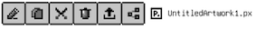
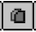
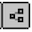

# File/folder options

## How to show the options

Each entry in the browser has a few actions that you can use to manipulate the files and folders. 
To reveal those options, long press on the file/folder or swipe right. 

## Files/folder options
The options to manipulate files and folders are:
- : Rename
- : Copy
- : Cut
- : Delete
- : Export. If the selected entry is a folder, it will export all the artworks inside that folder and compress them into a zip file. For more info, check out [Export](../../Export/export.md)
- : Share. Use this option to quickly share the `.px` file, such as via email, air-drop, etc.

## File/folder copy/cut
When there are file/folder being copied/cut, the `Paste` button will appear at the bottom right of the browser window. After navigating to the destination location, you can hit that button to paste.

## `Files` app compatability
**Note**: Pixquare's file system is also exposed in `Files` app. You can also manage your files there as well. However, if the names include special characters, please do not rename them in `Files` as Pixquare does apply URL percent encoding, so those entries with special characters will not be operatable in Pixquare.
