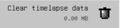
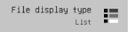

# File browser settings
While in the file browser, you can tap on the setting icon  to open the settings panel.

## Clear timelapse data
  
Timelapse data after a while can accumulate a huge chunk of storage. You can clear this data by tapping this option. Note that this will clear all data for all files, so if you have any timelapse you have not exported, be sure to do so before clearing the data.

## File display type
 
The files in the browser can be displayed as icons (artwork preview) or as a list (compact form). You can select one to suit your needs.

## File sort
 
To organize the files and folders, you can sort them. There are 3 properties that you can use to sort: name, file size, last modified date. Sorting can be done in ascending or descending order. 

## Theme customization
You can access theme customization from the file browser settings. To learn more about theme customization you can visit the [Guides and info](https://github.com/pixquare/themes/blob/main/README.md)

## Quick tips
 
This is the quick tips that you're reading. If you want to turn this section off, you can toggle it here.
