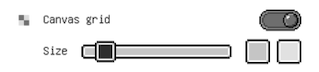
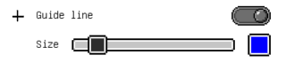

# Workspace canvas options

## Pixel grid
 
When this option is on, the boundary of each pixel will be shown. Note that the boundary will only show if the pixel are bigger than a certain threshold. 
You can also change the color of the grid. Tap on the color box to do that.

## Canvas grid
 
If we want a checkerboard pattern on your canvas, you can enable this option to achieve that. 
You can also change how big the grid are and colors of the checkerboard.

## Guide lines
 
Guide lines are similar to canvas grid above, however this will be lines instead of color block. Unlike canvas grid which appears underneath artwork's content, guide lines appears above the content.

## Canvas rotate
 
You already know that you can pan the canvas using two-finger drag. But with this option you can also rotate the canvas when you twist the canvas using two fingers.

## Canvas resize
 
If the current canvas size doesn't fit what you want to do, you can resize it with this option. Note that resizing the canvas will also remove this artwork's timelapse data and it's irreversible. 
More on canvas resize [here TODO]()

## Canvas flip
 
This option will flip the entire canvas (all layers and all frames) horizontally or vertically. This action will be added to undo/redo, so you can always reverse that.
