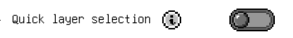
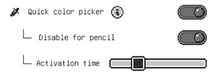
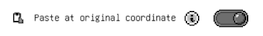

# Workspace drawing options

## Only draw with pencil
 
If you have a pencil, it is recommended to turn this feature on so that there will be no accidental draw input from your hand. Additionally, a suite of other features will be available if you turn this `Only draw with pencil` feature on now. 
When this feature is enabled, finger touches will no longer be registered on canvas for drawing tools. However, this will enable the finger touches to do more things.

## Quick layer selection
 
Pre-condition: `Only draw with pencil` is enabled. 
This feature will automatically select a layer by finger-tapping on its content. This can lead to accidential layer switch if iPad's palm rejection fails to work properly.

## Quick color picker
 
This feature enables you to use your finger to quickly select a color with long press. It comes with some customizations:
- `Disable for pencil`: This is defaulted to be on to avoid drawing strokes being canceled for color picker, but if you want, you can disable this and you can long press using the pencil to trigger quick color picker as well.
- `Activation time`: The long press wait time before it triggers the color picker.

## Auto select brush
 
Pre-condition: `Quick color picker` is enabled. 
With this option enabled, right after you pick a color using quick picker, it will automatically select brush as the active tool.

## Paste at original coordinate
 
By default, when you paste content, it will paste right at the center of your current screen. However, sometimes it's useful to paste at the original coordinate of the content (when copying some content to the next frame for example). Enable this option if you want that behavior.
