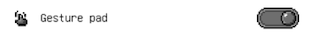

# Workspace additional features
A few features will not be shown if not turned on.

## Gesture pad
 
This is a replacement for the keyboard on the iPad. Using gestures to do quick actions. More info [here TODO]()

## Symmetry tool
 
This tool lets you add horizontal and vertical symmetric axes. They can be moved around and you can add unlimited numbers of symmetric axes. More info [here TODO]()

## Reference image
 
If you want to import images and keep them on the side as references. You should enable this now. More info [here TODO]()

## Left-hand mode
 
This option is for the lefties. Once enabled, it will switch the position of UI elements so that you guys can use Pixquare more comfortably.
