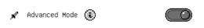
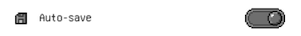
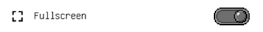
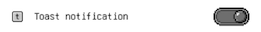

# Workspace general menu

## Advanced mode
 
Pixquare doesn't want to overwhelm beginners right at the beginning, so a few features can be hidden by turning off Advanced Mode.\nIf you're feeling that Pixquare has too many options that you don't know to use and want to learn the basics first, you can turn this off. Once you're comfortable with the app, you can come back and re-endable Advanced Mode.

## Auto-save
 
When you edit an artwork, if this option is on, your changes will be saved automatically after 1 second of inactivity. If this option is off, when there are unsaved changes, a Save button  will show up at the top left corner for you to save it manually.

## Fullscreen
 
On some devices that has the home bar instead of a physical home button, you can enable this option so that the canvas covers the entire screen including that extra space at the bottom.

## Toast notification
 
At the top of the canvas, there is a toast notification that let you know what's going on with the workspace. You can turn it off with this toggle.

## Export
 
To learn more about export, click [here TODO]()
