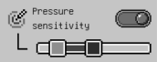
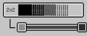
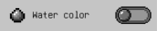

# Common tool options

## Pixel perfect
 
Pixel perfect helps you create cleaner lines easier by avoiding unwanted corner pixels.  
This option is available for [brush](brush.md) and [eraser](eraser.md).

## Pressure sensitivity
 
If you're using a pencil, you can enabled this option so that the size of strokes will be dynamic based on the pressure of the pencil, the curve linear. Once enabled, you can adjust the range of the curve, the max range is 0x to 3x the current size. 
This option is available for [brush](brush.md) and [eraser](eraser.md).

## Dithering
 
There are 4 dithering type: none, 2x2, 4x4, and 8x8. This option is available for [brush](brush.md), [eraser](eraser.md), and [Color bucket with gradient fill mode](color_bucket.md). 
For brush and eraser, you can adjust the intensity range. If you want to have a constant pattern, you can set the lower bound and upper bound of the range to be the same value.

## Stroke type
 
This is the shape that will be stamped on the path of stroke. You can select a square or round shape.  
This option is available for all drawing tools.

## Water color
 
With this option enabled, when you draw translucent color (alpha less than 100%), it will paint that color on top of the current content. If this option is off, the new color will replace the current content. A trick with this is that you can turn this off, then drag opacity to 0%, at this point, drawing tools will act as eraser.  
This option is available for all drawing tools.
